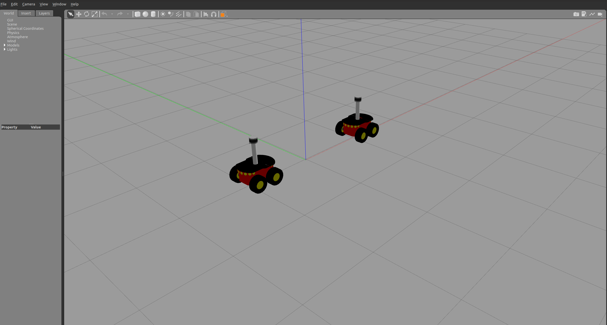
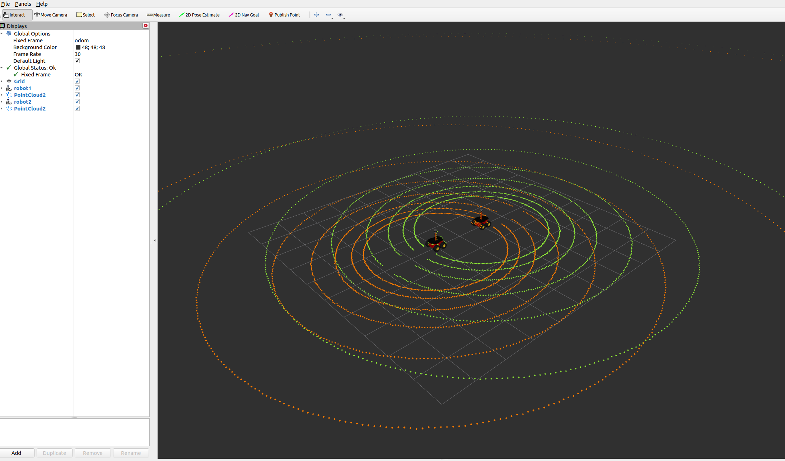
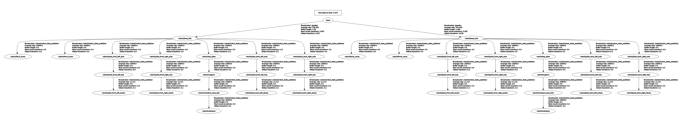

A xacro model for the pioneer3at robot equipped with velodyne VLP-16 Lidar sensor.

## Usage

To show a single robot in gazebo, run:
```bash
roslaunch p2os_urdf run.launch
```

To show two robots in gazebo, and visualize their Lidar readings in RVIZ, run:
```bash
roslaunch p2os_urdf run_two.launch
```





